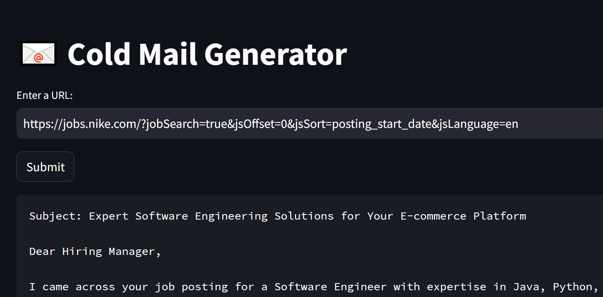
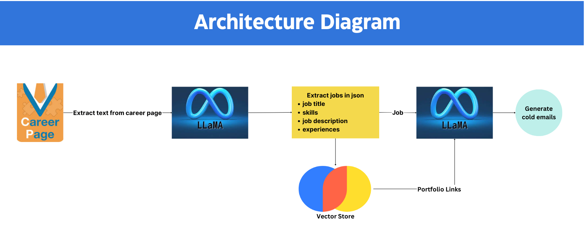

# Cold-mail-generator

A software services company has built a tool using Groq, Langchain, and Streamlit. The tool lets users enter a company's career page URL. It then pulls job listings from the page and creates custom cold emails. These emails include links to portfolios, which are picked from a vector database based on the job descriptions. Here we used a dummy data set consist of 'Techstack' and 'Link' of ABC company. And as career link we used here Nick carrer page for real time testing our streamlit app.

**For example:**

Ram is looking for a Principal Software Engineer. They are spending a lot of time and money on hiring, onboarding, and training. ABC, a software development company, can provide Ram with a skilled engineer right away. Mohan, a business development executive from ABC, will send Ram a cold email offering their services.

# Architecture Diagram

# Why do we use vector database?
- Vector database excel at finding data points that are conceptually similar, even if they don't have exact keyword matches by using vector embeddings that capture the meaning
  of the data. Basically they calculate the ED between query and probable matches and give the result according to the shortest distance.
- And more over it is designed to seamlessly integarte with ML models, allowing you to directly store and query vector representations generated by AI algorithm.

  
# Set-up

- To get started we first need to get an API_KEY from here: https://console.groq.com/keys. Inside app/.env update the value of GROQ_API_KEY with the API_KEY you created.

- To get started, first install the dependencies using:

           pip install -r requirements.txt

- Run the streamlit app:

          streamlit run app/main.py
